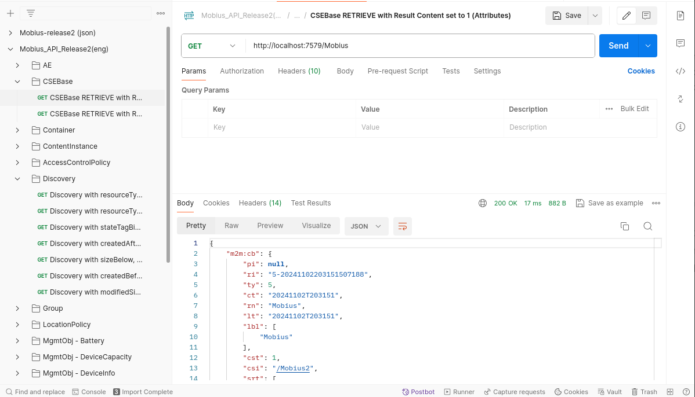

# Instructions for Setting Up the Server

## Server Info

El servidor se encuentra corriendo en el puerto 7579.

## Instalación

Para levantar el servidor:

```
docker compose up
```

Para detener el servidor:

```
docker compose stop
```

Para levantar el servidor sin datos almacenados y hacer una instalación limpia:

```
echo "y" | docker container prune
docker image rm -f mobius-platform-mobius_platform
docker image rm -f mobius-platform-mysql
docker volume rm mysql-data
docker compose up
```

## Testing

Podemos testear el servidor como sigue:

1. Vamos a [Onem2mTestApi](https://github.com/IoTKETI/oneM2M-API-Testing) y nos clonamos el respositorio

2. En postman importamos los recursos descargados

3. Realizamos una petición al servidor, basándonos en las plantillas de testing que hemos descargado, y vemos si nos devuelve correctamente una respuesta o nos indica un error, por ejemplo para una petición exitosa:



## Monitorización de Containers

Para la monitorización de los contenedores también existe un software (aunque solo funciona en Windows 😔). Está desarrollado por la misma empresa de Mobius, el software es [oneM2MBrowser](https://github.com/IoTKETI/oneM2MBrowser).

